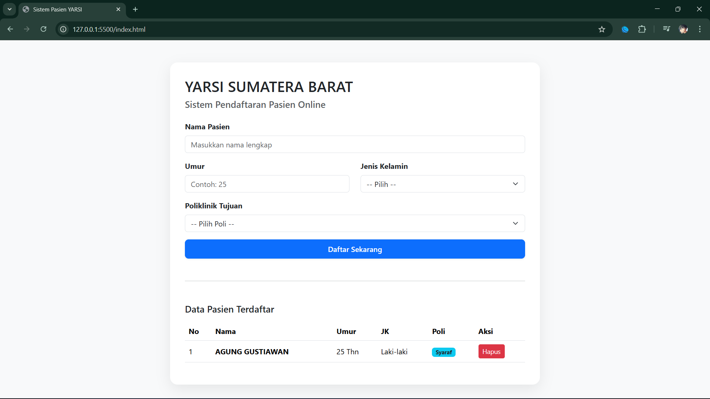

# Sistem Pendaftaran Pasien Online
Prototipe sistem pendaftaran pasien berbasis web menggunakan HTML, CSS, dan JavaScript.

### 1. Tampilan Antarmuka (UI)

### 2. Fitur Input & Manajemen Data

### 3. Sistem Validasi Keamanan Data

---
**Teknologi yang Digunakan:**
* HTML5 & Bootstrap 5 (Struktur & Layout)
* JavaScript ES6 (Logika & Validasi)
* CSS3 (Styling Custom)
